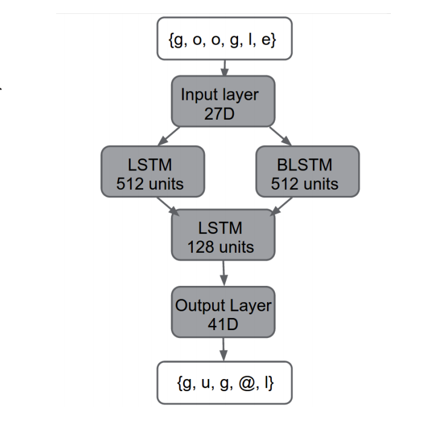

# Structure

The folder contains the followings:

- `main.py` the file that contains the model.
- `cmudict.dict`, training data which contains a word and its corresponding phonems.
- `cmudict.phones`, list of all phonems.
- `phonems.csv`, a csv file for `cmudict.phones`, with approporiate column names.
- `data.json.gz`, `data.json.bz2` and `words.csv` are all the same file compressed differently. It is the preprocessed version of the `cmudict.dict` with two columns: `word_encoded` and `phonem_encoded`. Please read [encoding](#Encoding) for more details.
- `weights.hdf5`, is a pretrained model (not fully trained as I don't have access to an nvidia GPU, just trained it on my laptop's CPU for an hour or so).
- `convert.py`, a preprocessor program to preprocess the data. I already ran it and data is included in the repo.
- `toy.ipynb`, a Jupyter Notebook, which has the results of me playing around with the model and some predictions from the model.

# Model

This model is based on google's paper: [`GRAPHEME-TO-PHONEME CONVERSION USING LONG SHORT-TERM MEMORY RECURRENT NEURAL NETWORKS`](https://static.googleusercontent.com/media/research.google.com/en//pubs/archive/43264.pdf), and I implemented the fully delayed version of it.

# Encoding

As mentioned above, this is based on the fully delayed version of google's G2P. What it means is that given word, it wil be converted to the followings:
WORD -> [W, O, R, D, %] -> [W, O, R, D, %, ?, ?, ?]

`%` represents end of the word, `?` represents what the model has to predict. In this case, it means that the word `WORD` must have 3 phonems, and model has to figure out what they are. As for the output of the model, it would look something like this: [?, ?, ?, ?, ?, W, ER, D]. In this case, whatever that is after `%` is the models predictions.

Before feeding anything to the model, all the words must follow the structure mentioned above and should be represented as an array of one-hot encoded vectors. Method `encode_text` will do the heavy lifting for you and converts your string into the desired format. Likewise `decode_phonem` will do the opposite of `encode_text` where it will generate an string based on the output of the model. Read the code for more details.
